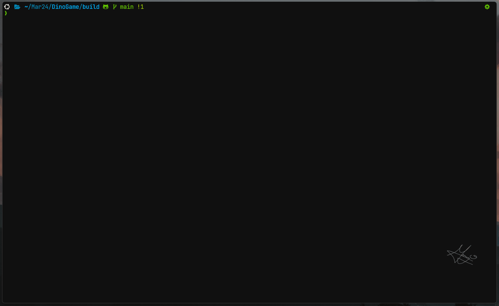

# DinoGame
A copy of Chrome's Dinosaur game, but in the terminal


## Gameplay
```bash
./dinogg
```


## Setup

1. Install ncurses
```bash
sudo apt-get install libncurses5-dev libncursesw5-dev
```

2. Clone the repo

```bash
git clone https://github.com/iameraj/DinoGame.git
```

3. Cd into the repo and Generate build files
```bash
cd DinoGame
mkdir build
cd build
cmake ..
```

4. Make & Execute
```bash
# 'make' will make the excutable
make

# gg
./dinogg
```
